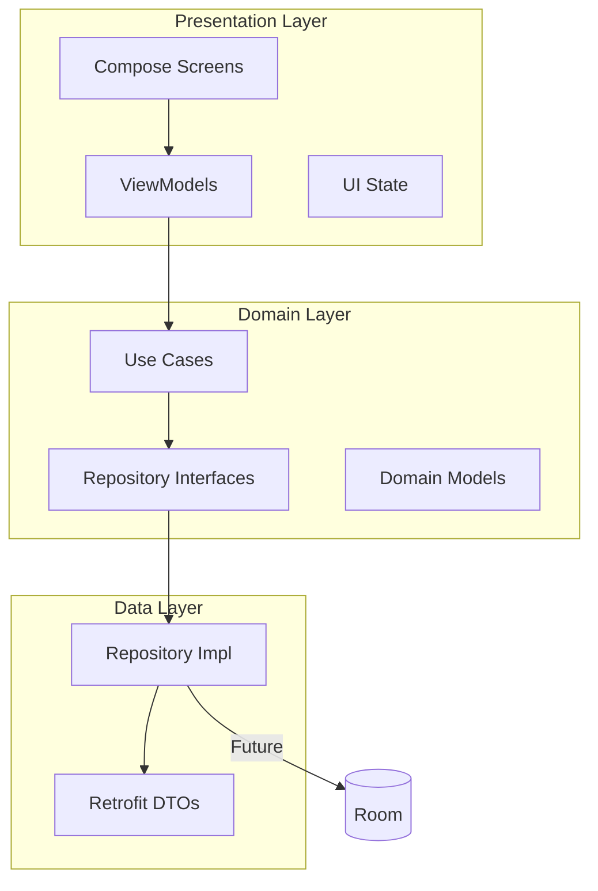
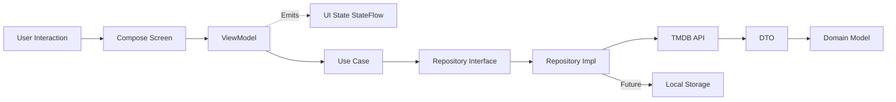
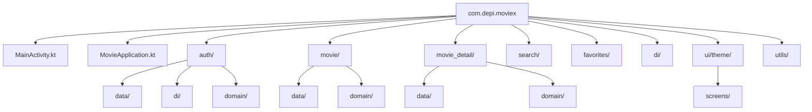

# Architecture

MovieX follows **Well-Architected** design combined with **MVVM** pattern, creating a clear separation of concerns across three main layers. This architecture ensures testability, maintainability, and scalability.

---

## Layer Overview



**Dependency Rule**: Outer layers depend inward. `Presentation` → `Domain` ← `Data`. The `Domain` layer knows nothing about Android or Retrofit.

---

## Data Flow



---

## Package Structure



---

## UI State Pattern

Each screen follows a consistent state management pattern using `StateFlow`:

### State Class
```kotlin
data class HomeState(
    val discoverMovies: List<Movie> = emptyList(),
    val trendingMovies: List<Movie> = emptyList(),
    val tvShows: List<Movie> = emptyList(),
    val actionMovies: List<Movie> = emptyList(),
    val dramaMovies: List<Movie> = emptyList(),
    val comedyMovies: List<Movie> = emptyList(),
    val error: String? = null,
    val isLoading: Boolean = false
)
```

### ViewModel
```kotlin
@HiltViewModel
class HomeViewModel @Inject constructor(
    private val repository: MovieRepository
) : ViewModel() {

    private val _homeState = MutableStateFlow(HomeState())
    val homeState = _homeState.asStateFlow()

    // State updates via collectAndHandle utility
}
```

### Compose Screen
```kotlin
@Composable
fun HomeScreen(
    homeViewModel: HomeViewModel = hiltViewModel()
) {
    val state by homeViewModel.homeState.collectAsStateWithLifecycle()

    when {
        state.isLoading -> LoadingIndicator()
        state.error != null -> ErrorSection(error = state.error!!)
        else -> Content(movies = state.discoverMovies)
    }
}
```

---

## Response Wrapper

All repository calls return a `Response<T>` sealed class:

```kotlin
sealed class Response<out T> {
    data class Success<T>(val data: T) : Response<T>()
    data class Error(val message: String, val code: Int? = null) : Response<T>()
    object Loading : Response<Nothing>()
}
```

Usage:
```kotlin
repository.fetchMovies().collectAndHandle(
    onError = { error -> /* handle error */ },
    onLoading = { /* show loading */ },
    onSuccess = { movies -> /* show data */ }
)
```

---

## Dependency Injection

MovieX uses **Hilt** for dependency injection. Modules are defined in the `di/` package.

### Example Module
```kotlin
@Module
@InstallIn(SingletonComponent::class)
object MovieModule {

    @Provides
    @Singleton
    fun provideMovieRepository(
        apiService: MovieApiService,
        mapper: ApiMapper<Movie, MovieDto>
    ): MovieRepository = MovieRepositoryImpl(apiService, mapper)

    @Provides
    @Singleton
    fun provideMovieApiService(): MovieApiService {
        // Retrofit setup
    }
}
```

---

## Navigation

Navigation is handled via **Jetpack Navigation Compose**:

```kotlin
NavHost(
    navController = navController,
    startDestination = "splash"
) {
    composable("splash") { SplashScreen(...) }
    composable("home") {
        HomeScreen(onMovieClick = { movieId ->
            navController.navigate("movie_detail/$movieId")
        })
    }
    composable(
        route = "movie_detail/{movieId}",
        arguments = listOf(navArgument("movieId") { type = NavType.IntType })
    ) { MovieDetailScreen(...) }
}
```

---

## Scalability Considerations

| Concern | Approach |
|---------|----------|
| Feature Growth | Split into Gradle modules per feature |
| State Complexity | Adopt MVI with Orbit or custom implementation |
| Offline Support | Room + RemoteMediator (Paging 3) |
| Multi-module | `:core`, `:feature:home`, `:data` |
| Testing | Use cases are plain Kotlin → easily unit tested |
| Large Codebase | Feature-based package structure |

---

## Key Principles

1. **Single Responsibility** - Each class has one clear purpose
2. **Dependency Inversion** - Depend on abstractions, not concretions
3. **Testability** - Domain layer has no Android dependencies
4. **Consistency** - Same pattern across all features
5. **Separation of Concerns** - UI, business logic, and data are separate